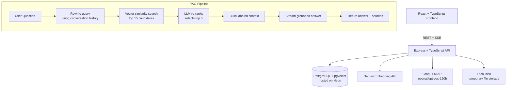

# AI Knowledge Workspace

A full-stack, production-style RAG (Retrieval-Augmented Generation) platform for organizing personal documents and asking questions grounded in your own knowledge — with source citations, semantic search, conversational memory, and streaming answers.

**Live demo:** [ai-knowledge-workspace-five.vercel.app](https://ai-knowledge-workspace-five.vercel.app)

> Note: the backend runs on Render's free tier, which spins down after 15 minutes of inactivity. The first request after a period of idle time may take 30–60 seconds while it wakes up. The app pre-warms the server on load and retries failed database connections automatically, but the very first visit after a long idle period may still feel slow — this is expected, not a bug.

---

## What it does

Upload your notes, PDFs, or documentation into organized workspaces, then:

- **Ask questions** and get answers grounded in your own documents, with source citations — not generic LLM knowledge
- **Search semantically** — find relevant content by meaning, not just keyword matching
- **Chat conversationally** — follow-up questions like "what about its diet?" are automatically understood in context
- **Summarize** any document with one click
- Watch answers **stream in token-by-token**, with live status updates showing the retrieval pipeline as it runs

---

## Why this isn't just "upload a PDF and chat with it"

Most RAG demos stop at: embed a document, do a vector search, paste results into a prompt. This project goes further:

- **Query rewriting** — follow-up questions are rewritten into standalone queries using recent conversation history before being searched, so pronouns and implicit context ("it", "the other one") resolve correctly
- **Re-ranking** — the system over-fetches 15 candidate chunks from vector search, then uses the LLM as a relevance judge to select and reorder the true top 5, rather than trusting raw cosine similarity alone
- **Two-level authorization** — every query is scoped to the authenticated user at the database level (not just the UI), including inside the raw SQL used for vector search, so it's structurally impossible to retrieve another user's data
- **Streaming with real pipeline visibility** — the UI shows "Searching your documents…" → "Ranking most relevant results…" → "Generating answer…" as genuine, real-time stages, not a fake loading spinner

---

## Architecture



**Deployment:** Frontend on Vercel · Backend on Render · Database on Neon (serverless Postgres + pgvector) · CI on GitHub Actions

The application is a deliberate **modular monolith** — no microservices, no message queues, no container orchestration. Documents are processed synchronously in the background (not awaited by the upload request), which is sufficient at this project's scale and avoids infrastructure (Redis, BullMQ, Kafka) that would add operational complexity without solving a real bottleneck.

---

## Tech stack

**Frontend**
React · TypeScript · Vite · Tailwind CSS · React Router · Axios · react-markdown

**Backend**
Node.js · Express · TypeScript · Prisma (relational queries) + raw SQL (pgvector operations) · Zod (validation) · JWT + bcrypt (auth) · Multer (file uploads)

**AI / Data**
PostgreSQL + pgvector (Neon) · Google Gemini (`gemini-embedding-001`, 768-dim embeddings) · Groq (`openai/gpt-oss-120b`) for generation, query rewriting, re-ranking, summarization, and title generation

**Testing & CI**
Jest · Supertest · GitHub Actions (runs the full test suite against an isolated Neon database branch on every push)

---

## Database schema

```
User
 └─ Workspace
     ├─ Document
     │   └─ DocumentChunk (content + 768-dim vector embedding)
     └─ Conversation
         └─ Message (role: USER | ASSISTANT, optional source citations as JSON)
```

Every child record carries a foreign key back to its owner, and every query — including the raw SQL vector search — filters by the authenticated user's ID at the database layer, not just in application logic.

---

## RAG pipeline, step by step

1. **Query rewriting** — if the conversation has prior messages, the question is rewritten into a standalone query using the last few exchanges (e.g. "what about its diet?" → "What is an elephant's diet?")
2. **Vector search** — the rewritten query is embedded and compared against stored chunk embeddings using pgvector's cosine distance operator (`<=>`), scoped to the requested document/workspace and the authenticated user
3. **Re-ranking** — the top 15 candidates are passed to the LLM, which selects and orders the 5 most genuinely relevant to the question
4. **Context construction** — the selected chunks are labeled by source document and assembled into a single context block
5. **Grounded generation** — the LLM is instructed to answer using only the provided context, streamed back token-by-token over Server-Sent Events, with an explicit instruction to say so if the context is insufficient rather than guessing
6. **Source citations** — every answer returns the documents and similarity scores it drew from, and the full exchange is persisted to conversation history

---

## Local setup

### Prerequisites
- Node.js 22+
- A PostgreSQL database with the `pgvector` extension available (this project uses [Neon](https://neon.tech), free tier)
- API keys: [Google AI Studio](https://aistudio.google.com) (embeddings) and [Groq](https://console.groq.com) (LLM)

### Backend

```bash
cd backend
npm install
cp .env.example .env   # fill in your own values
npx prisma migrate deploy
npm run dev
```

### Frontend

```bash
cd frontend
npm install
cp .env.example .env   # set VITE_API_URL to your backend URL
npm run dev
```

### Environment variables (backend)

| Variable | Description |
|---|---|
| `DATABASE_URL` | Postgres connection string (must support the `vector` extension) |
| `JWT_SECRET` | Secret used to sign auth tokens |
| `GEMINI_API_KEY` | Google AI Studio key, used for embeddings |
| `GROQ_API_KEY` | Groq key, used for all LLM calls |
| `FRONTEND_URL` | Allowed CORS origin in production |
| `PORT` | Defaults to 5000 |

### Running tests

```bash
cd backend
npm test
```

Tests run against a separate database (configured via `.env.test`) so they never touch real data.

---

## API reference

| Method | Endpoint | Description |
|---|---|---|
| POST | `/api/auth/register` | Create an account |
| POST | `/api/auth/login` | Log in, receive a JWT |
| GET | `/api/auth/me` | Get the current user |
| POST | `/api/workspaces` | Create a workspace |
| GET | `/api/workspaces` | List your workspaces |
| GET / PATCH / DELETE | `/api/workspaces/:id` | View, rename, or delete a workspace |
| POST | `/api/workspaces/:workspaceId/documents` | Upload a document (PDF/TXT/MD) |
| GET | `/api/workspaces/:workspaceId/documents` | List documents in a workspace |
| GET / DELETE | `/api/documents/:id` | View or delete a document |
| POST | `/api/documents/:id/summarize` | Generate a summary |
| GET | `/api/search` | Semantic search (`query`, `workspaceId` or `documentId`) |
| POST | `/api/workspaces/:workspaceId/conversations` | Start a conversation |
| GET | `/api/workspaces/:workspaceId/conversations` | List conversations |
| GET / DELETE | `/api/conversations/:id` | View or delete a conversation |
| POST | `/api/conversations/:id/messages/stream` | Ask a question (SSE stream) |

All routes except register/login require `Authorization: Bearer <token>`.

---

## Known limitations

- **Cold starts** — both Render (backend) and Neon (database) free tiers spin down after inactivity. The app pre-warms the backend on load and retries transient database connection failures automatically, but a first request after a long idle period can still take up to a minute.
- **Ephemeral file storage** — Render's free web services don't persist local disk writes across restarts. This doesn't affect search, chat, or summarization (extracted text and embeddings live in Postgres), but the original uploaded file itself isn't recoverable after a backend restart.
- **Summarization context limit** — very large documents are concatenated in full before summarization; extremely long documents could exceed the LLM's context window. At the current chunk sizes and typical document lengths this hasn't been an issue, but a production version would summarize in stages for large inputs.
- **Single-region deployment** — no CDN or multi-region failover; fine for a portfolio project, not a scale assumption.

---

## Possible future improvements

- Persistent object storage (S3-compatible) for uploaded files, decoupling them from the backend's filesystem
- Hybrid search combining vector similarity with keyword/full-text search
- Background job queue if processing volume ever outgrows synchronous handling
- Document comparison and multi-mode summarization (deliberately scoped out to keep this build focused)

---

## License

MIT
